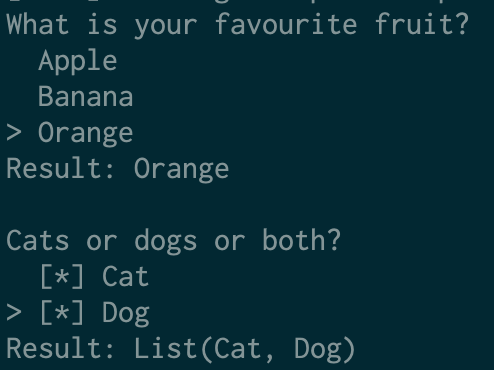

# Smenu
[](https://travis-ci.org/kovszilard/smenu)
[](https://search.maven.org/search?q=smenu)
[](https://twitter.com/intent/tweet?text=Wow:&url=https%3A%2F%2Fgithub.com%2Fkovszilard%2Fsmenu)
[](https://twitter.com/intent/follow?screen_name=kovszilard)

Simple menus for Scala console applications



## Features

* Functional API
* Menu is displayed using Show instance of menu elements. (You are not restricted to use String elements only.) 
* Pluggable effect type, based on cats-effect

## Usage

Include it in your project by adding the following to your build.sbt:

```scala
libraryDependencies += "com.github.kovszilard" %% "smenu" % "0.1.0"
```

### Singe choice menu

```scala
// Using IO for effect, and String for menu elements
import cats.Show
import cats.instances.all._
import cats.syntax.all._
import cats.data.NonEmptyList
import cats.effect.IO
import smenu.Menu._

singleChoiceMenu[IO, String]("What is your favourite fruit?", NonEmptyList.of("Apple", "Banana", "Orange"))
```

### Multiple choice menu

```scala
// Using IO for effect, and Pet for menu elements
import cats.Show
import cats.instances.all._
import cats.syntax.all._
import cats.data.NonEmptyList
import cats.effect.IO
import smenu.Menu._

trait Pet
case object Cat extends Pet
case object Dog extends Pet

implicit def showPet: Show[Pet] = Show[String].contramap(_.toString)

multipleChoiceMenu[IO, Pet]("Cats or dogs or both?", NonEmptyList.of(Cat, Dog))
```
